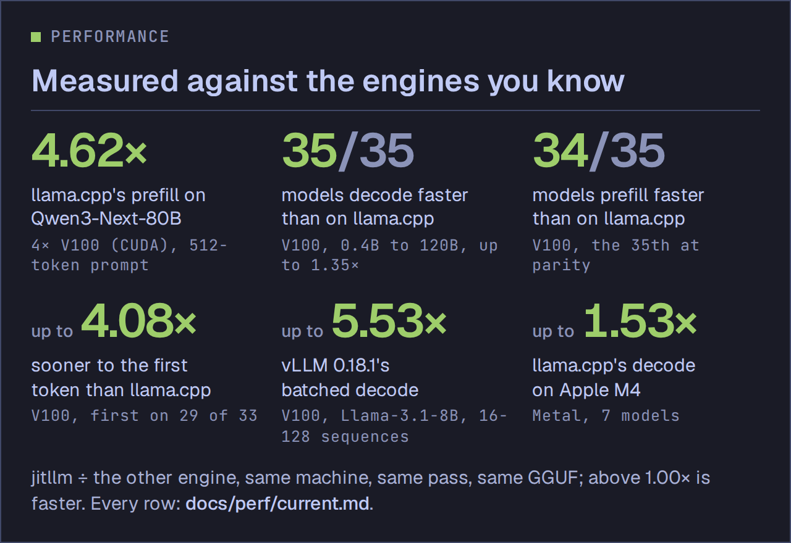
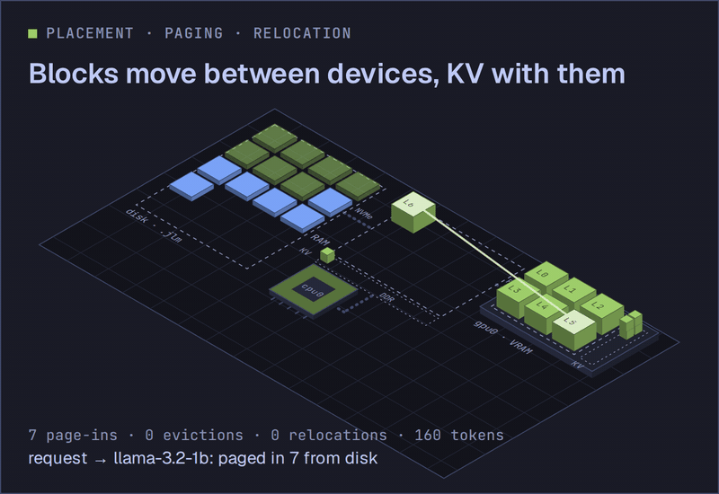
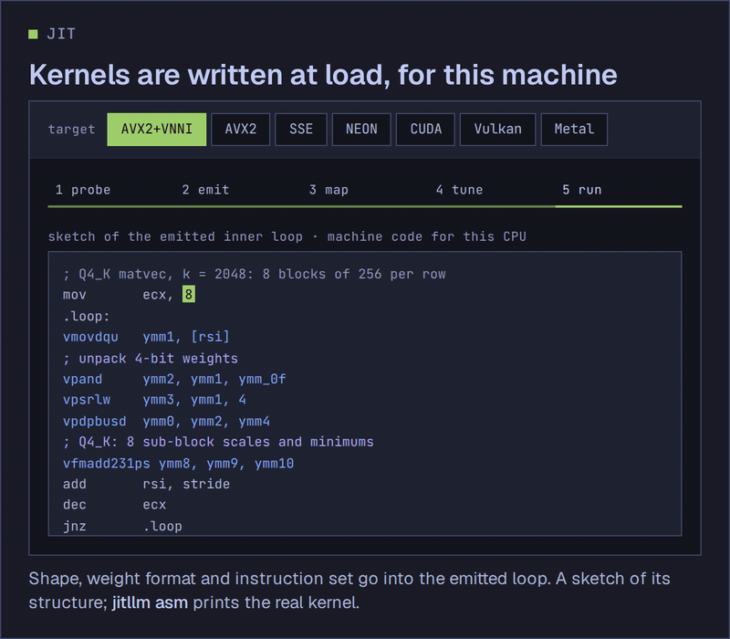
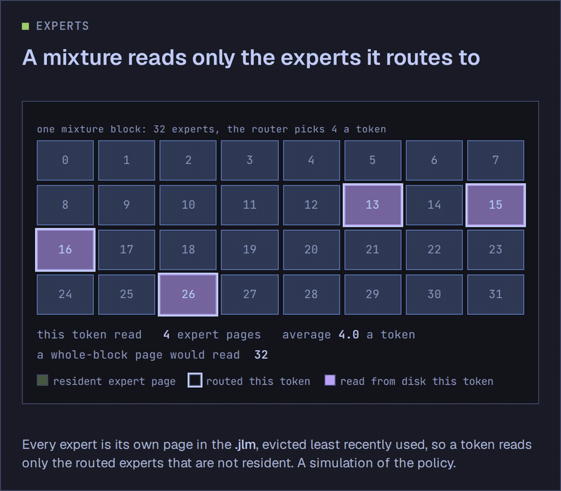
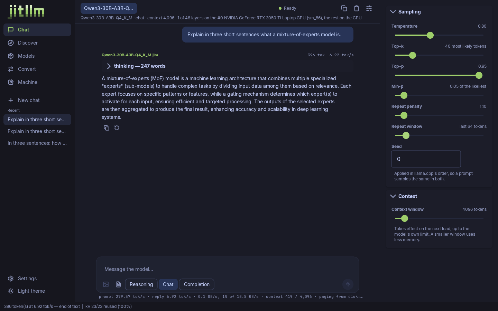
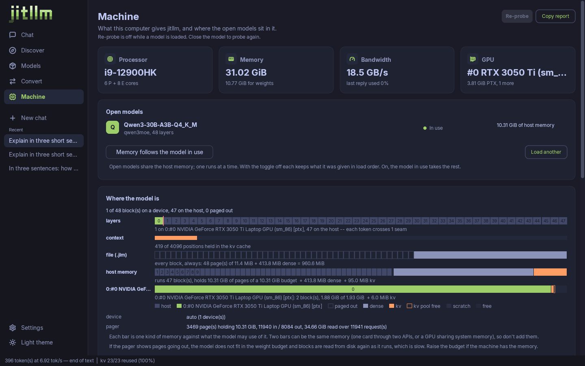
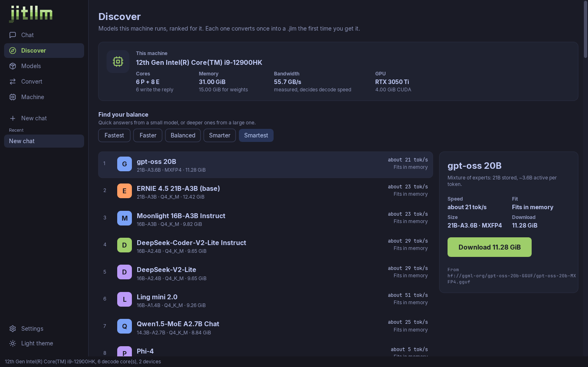
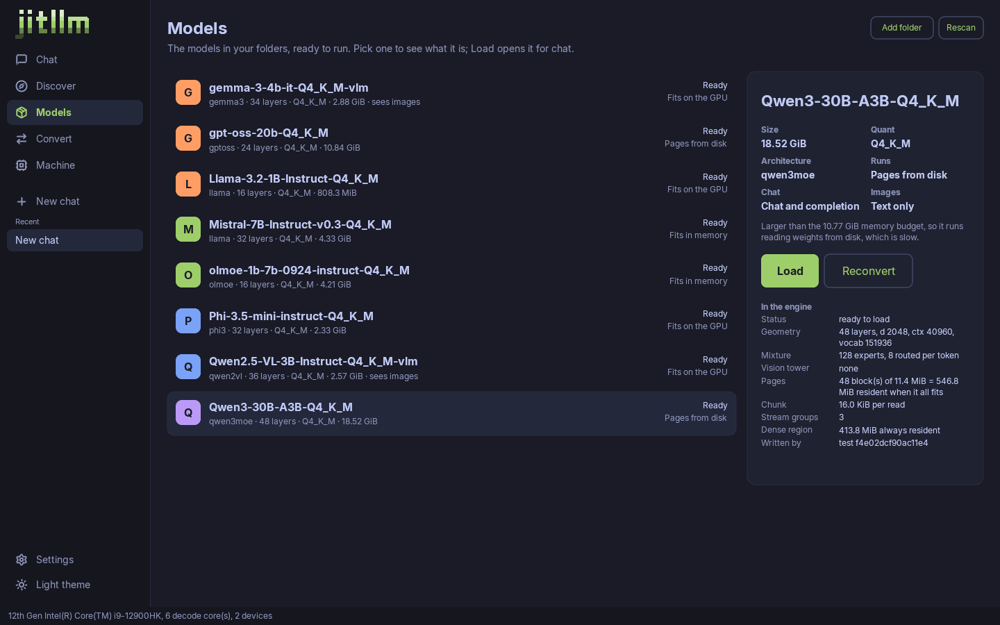
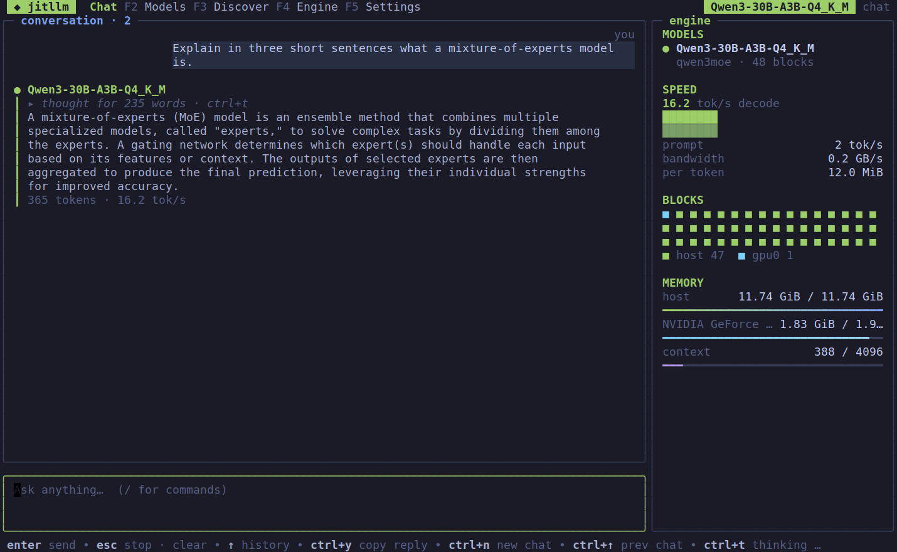
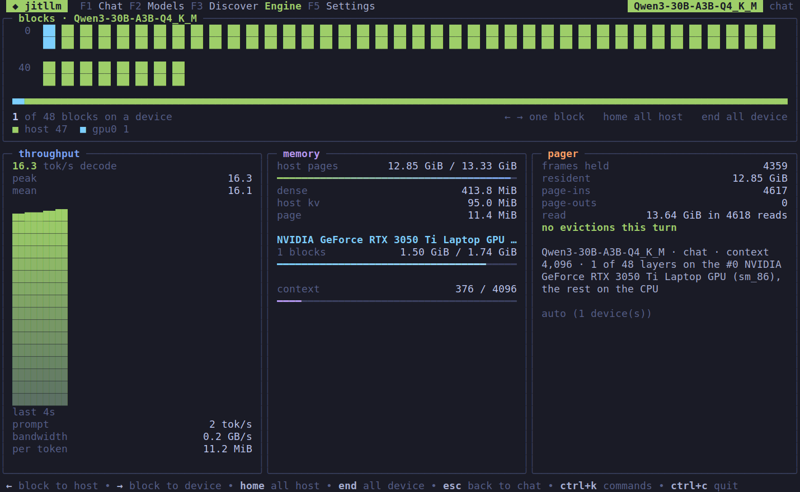

<p align="center"><picture><source media="(prefers-color-scheme: dark)" srcset="docs/assets/jitllm.svg"></picture></p>

<h3 align="center">Your models. Your hardware. Full speed.</h3>

<p align="center">
<a href="https://github.com/jitllm/jitllm/releases/latest"></a>
<a href="LICENSE"></a>
</p>

<p align="center">
<a href="#quick-start">Get started</a> ·
<a href="#performance">Benchmarks</a> ·
<a href="https://jitllm.org/docs/">Docs</a> ·
<a href="https://github.com/jitllm/jitllm/releases/latest">Download</a>
</p>

<p align="center">
<a href="#performance"></a>
<a href="#the-five-principles"></a>
</p>
<p align="center">
<a href="#how-it-works"></a>
<a href="#memory-and-placement"></a>
</p>

**An operating system for LLM inference: generate the compute for your hardware,
page models larger than memory, and move execution without losing the conversation.**

[jitllm.org](https://jitllm.org) · [Documentation](https://jitllm.org/docs/) · [Latest release](https://github.com/jitllm/jitllm/releases/latest)

- **Every kernel JIT-generated at load time** for your CPU (AVX2, SSE, NEON)
  or GPU (CUDA, Vulkan, Metal), specialised to the model's shapes and weight
  formats. No precompiled kernels or interpreted compute fallback.
- **Disk, RAM and VRAM form the memory system.** Weights, routed MoE experts
  and KV state page as needed. Blocks move between CPU and GPUs at run time,
  carrying their attention and recurrent state with them.
- **Many sessions share the work.** Continuous batching on the CPU and the GPU
  shares each weight read across requests, prompts are fed in chunks beside
  running decodes, and a fairness level (`-fairness 0-100`) time-slices sessions
  through the card when they do not all fit.
- **Runs everywhere, depends on nothing.** One binary per platform (Linux, macOS,
  Windows; x86 and Arm) that finds CUDA, Vulkan or Metal at run time and
  otherwise runs on the CPU.

Serve it as an **OpenAI- and Anthropic-compatible API** with streaming and tool
calling from one standalone binary, `jitllmd`, or embed it as a Go library. There
are [desktop](#desktop-app) and [terminal](#terminal-app) apps too.

| Use jitllm for | Start here |
|---|---|
| Serving models over an API | [Quick start](#quick-start) · [Server reference](docs/server.md) |
| Containers | [Docker](#docker) |
| Inference inside a Go program | [Go library guide](docs/embedding-go.md) |
| Chatting, and watching where each block runs | [Desktop app](#desktop-app) · [Terminal app](#terminal-app) |

## The engine

- **Kernels written for the machine in front of it.** Every kernel is emitted
  at load for the model's shapes and weight formats: x86 (SSE, AVX2, AVX-512,
  VNNI) and Arm (NEON, dot-product) machine code on the CPU, PTX for CUDA
  (tensor cores from Volta on), SPIR-V for Vulkan, Metal shaders, and AMDGPU
  for ROCm (not yet tested on AMD hardware). No vendor math library, no
  interpreted fallback.
- **Layers move mid-conversation.** Blocks relocate between the CPU and any
  GPU, or from one GPU to another, carrying their KV pages and recurrent state,
  and the answer stays the same.
- **Models bigger than memory.** Disk, RAM and VRAM are one paged hierarchy:
  weights page in on demand (read with O_DIRECT, never mmap), every expert of a
  mixture is its own page so a token reads only the experts it routes to, and
  KV history pages and streams through the card.
- **Broad coverage, held to the reference.** 57 graphs (65 GGUF architecture names, 30 Hugging Face classes) and 17
  vision projectors: dense, mixture-of-experts, MLA, gated-delta and
  state-space hybrids, vision-language, embeddings and decision models, each
  gated against llama.cpp or the model's own transformers class.
- **No garbage on the hot path.** A warm decode token allocates nothing on the
  Go heap, on the host and every GPU backend; weights and page frames live off
  the heap.
- **Faster tokens, same distribution.** Speculative decoding with a model's own
  prediction head or prompt lookup, an int8 KV cache, prefix caching and
  shared prefixes across sessions.

## The server

One binary, `jitllmd`, many models and many sessions at once:

- **OpenAI, Anthropic and Connect APIs**: chat, completions, messages,
  embeddings, Batches and Files, with streaming.
- **Tool calling in each model's own format** (24 families, from Hermes and
  Llama to gpt-oss Harmony, DeepSeek, Kimi and GLM), with `tool_choice`
  enforced by constrained decoding, and **structured output** from a JSON
  schema.
- **Pictures** through `image_url` and `image` blocks on vision models,
  log-probabilities, `n` choices from one prefill, and decision answers through
  `/v1/systemone`.
- **Continuous batching on the CPU and the GPU**, prompts fed in chunks beside
  running decodes, KV-aware admission, and a **fairness level**
  (`-fairness 0-100`) that time-slices sessions through the card by parking
  them to the host and back, with per-request priority.
- **A control plane**: load and unload models, create, park and resume
  sessions, move blocks between devices (`jitllmd models`, `sessions`,
  `place`, `stats`), and `/metrics` for Prometheus.

## Install

Linux and macOS:

```sh
curl -fsSL https://jitllm.org/install.sh | sh
```

Windows (PowerShell):

```powershell
irm https://jitllm.org/install.ps1 | iex
```

This installs the CLI, `jitllm`, and the server, `jitllmd`, from the latest
release, after checking each archive against the release's checksums: into
`~/.local/bin` (`/usr/local/bin` as root), or on Windows into
`%LOCALAPPDATA%\Programs\jitllm`, which it adds to your `PATH`. Add the apps with
`| sh -s -- all` (or `desktop`, `tui`), or `$env:JITLLM_PROGRAMS = "all"` before
the Windows line. Each program is one self-contained binary and its own archive
on the [Releases](https://github.com/jitllm/jitllm/releases/latest) page, for Linux,
macOS and Windows on x86-64 and arm64. GPUs need only their driver.

> **AMD GPUs:** they run through Vulkan with only the driver. With ROCm
> installed, jitllm also uses them through a native backend (`hip:0`, ...),
> which **has not yet been tested on AMD hardware**
> ([#34](https://github.com/jitllm/jitllm/issues/34)). To stay on the
> tested path, pick the Vulkan device explicitly (`-devices vulkan:0`).

To build from source instead, with **Go 1.26 or newer** and no C toolchain:

```sh
git clone https://github.com/jitllm/jitllm.git && cd jitllm
go build ./cmd/jitllm
(cd server && go build -o ../jitllmd ./cmd/jitllmd)
(cd ui && CGO_ENABLED=0 go build -o ../jitllm-desktop .)
(cd tui && go build -o ../jitllm-tui .)
```

## Quick start

```sh
# Fetch Qwen3-30B-A3B from the catalog and convert it (18.6 GB): a mixture of
# experts with 30B weights and 3B used per token. With less memory than it
# needs, it pages from disk.
mkdir -p models
jitllm convert -o models qwen3-30b-a3b models/qwen3.jlm

# Ask it something from the command line. It thinks first, then answers.
jitllm run -chat models/qwen3.jlm "Why is the sky blue?"

# Or serve it.
jitllmd serve -addr 127.0.0.1:8080 -models ./models \
  -load qwen3.jlm -id qwen3 -devices auto
```

From another terminal:

```sh
curl http://127.0.0.1:8080/v1/chat/completions \
  -H 'Content-Type: application/json' \
  -d '{"model":"qwen3","messages":[{"role":"user","content":"Why is the sky blue?"}],"stream":true}'
```

Flags go before the model path. `jitllm <command>` with no arguments prints the
usage.

Models run from `.jlm` containers, converted once from GGUF or Hugging Face
weights. See the [CLI and conversion guide](docs/cli.md) for other inputs and flags,
and the [server reference](docs/server.md) for endpoints and daemon commands.

### Docker

```sh
docker volume create jitllm-models
docker run --rm -v jitllm-models:/models --entrypoint jitllm ghcr.io/jitllm/jitllm convert qwen3-30b-a3b
docker run -d -p 8080:8080 -v jitllm-models:/models ghcr.io/jitllm/jitllm -load Qwen3-30B-A3B-Q4_K_M.jlm -id qwen3
```

Add `--gpus all` (with the NVIDIA Container Toolkit) to run on an NVIDIA GPU. The image is
`jitllmd` with the `jitllm` CLI beside it, for linux/amd64 and linux/arm64;
`docker build -t jitllm .` builds it from a checkout. See [docs/docker.md](docs/docker.md).

### Desktop app

Model downloads, conversion, text and image chat, and a live view of where each
block of the model sits, in one window. Install it with `| sh -s -- desktop` (or
take its archive from the Releases page) and run `jitllm-desktop`.

<p align="center">
<picture><source media="(prefers-color-scheme: light)" srcset="website/public/shots/chat-light.png"></picture>
<picture><source media="(prefers-color-scheme: light)" srcset="website/public/shots/machine-light.png"></picture>
</p>
<p align="center">
<picture><source media="(prefers-color-scheme: light)" srcset="website/public/shots/discover-smartest-light.png"></picture>
<picture><source media="(prefers-color-scheme: light)" srcset="website/public/shots/models-light.png"></picture>
</p>

### Terminal app

The same screens in a terminal, over SSH too, sharing the desktop app's settings
and chats. The arrow keys move the model's blocks between the CPU and the GPU,
and the conversation keeps its history across the move. Install it with
`| sh -s -- tui` and run `jitllm-tui models/qwen3.jlm`.

<p align="center">


</p>

## Supported models

`convert` reads 65 GGUF architecture names (57 graphs), 30 Hugging Face safetensors
classes and 17 vision projectors; anything else is refused at conversion, by name.

| Kind | Families |
|---|---|
| **Text and code** | Llama 2/3, Mistral, Mixtral, SmolLM2/3, Qwen2 to Qwen3.6 (dense, MoE, Next and VL text), Gemma 1 to 4 and 3n, Phi-2/3/4 and Phi-3.5-MoE, DeepSeek V2/V3/R1/V3.2/V4, Kimi-K2, Kimi Linear, Kimi-K3, GLM-4/4.5/4.6/4.7-Flash, gpt-oss, Llama 4, Granite, OLMo 2/3, OLMoE, ERNIE 4.5, Hunyuan, MiniMax-M2/M3, Ling 2.0, dots.llm1, Apertus, EXAONE 4, Seed-OSS, Command-R/A, DBRX, Falcon, StarCoder 1/2, StableLM, Nemotron |
| **State-space and hybrid** | Mamba, Mamba-2, Jamba, Falcon-H1, Granite 4 hybrid, Nemotron-H, LFM2 |
| **Vision** | SmolVLM, LLaVA, Qwen2/2.5/3-VL, Qwen3.5, GLM-4.xV, Kimi-VL, HunyuanOCR, Gemma 3/3n/4, InternVL, MiniCPM-V, Janus-Pro, Pixtral/Mistral 3, Phi-4 vision, Llama 4 |
| **Embeddings** | BERT family, nomic-embed-text, Qwen3-Embedding, EmbeddingGemma |
| **Decision models** | Laya (ModernBERT), d1-3B, Lev 4B, answering one question against fixed labels through `/v1/systemone` |

Weights: F32, F16, BF16, Q4_0, Q5_0, Q5_1, Q8_0, Q3_K-Q6_K and MXFP4. The full list, generated
from the code, is [docs/models.md](docs/models.md); the [vision guide](docs/vision.md) covers pictures.

## Performance

Results vary by model, hardware and workload. The [scoreboard](docs/perf/current.md)
compares engines measured in the same pass on the same machine, with hardware,
backends, prompt lengths and generation lengths alongside the results.
The [performance overview](docs/performance.md) preserves the comparison tables
and their limitations; [scripts/vs-llamacpp.sh](scripts/vs-llamacpp.sh) measures your machine.

## Documentation

- [CLI and conversion](docs/cli.md) · [Server](docs/server.md) · [Docker](docs/docker.md) · [Devices](docs/devices.md)
- [Runtime](docs/runtime.md) · [Memory and placement](docs/placement.md) · [Vision](docs/vision.md)
- [Go library and desktop app](docs/embedding-go.md) · [Terminal app](docs/tui.md) · [Model API](engine/model/)
- [Project docs](docs/) · [Testing](docs/testing.md) · [Roadmap](ROADMAP.md)
- [Contributing](CONTRIBUTING.md) · [Project rules](AGENTS.md)

<a id="the-five-principles"></a>
<a id="how-it-works"></a>
<a id="memory-and-placement"></a>
The [five principles](docs/runtime.md#the-five-principles) govern every execution
path. See [how it works](docs/runtime.md#how-it-works) for the runtime, or
[memory and placement](docs/placement.md) for budgets and relocation.
