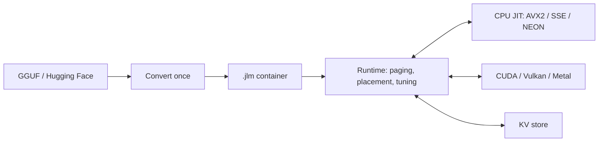

<p align="center"><picture><source media="(prefers-color-scheme: dark)" srcset="docs/assets/jitllm.svg"></picture></p>

<p align="center">
<a href="#performance"></a>
<a href="#the-five-principles"></a>
</p>
<p align="center">
<a href="#how-it-works"></a>
<a href="#memory-and-placement"></a>
</p>

# jitllm

**An operating system for LLM inference.**

jitllm scans your hardware, decides where each block of a model runs across
every CPU core and GPU, generates the kernels for that hardware at run time,
and pages weights, experts and KV state through memory as demand changes.

- **Run models larger than memory.** Weights page from disk through RAM and
  VRAM, and a mixture of experts reads only the experts each token routes to.
- **Relocate at run time.** Blocks move between the CPU and GPUs while a model
  serves, and their attention and recurrent state move with them, so a
  conversation survives the move.
- **Long context on a paged KV cache.** The cache grows a page at a time, spills
  to a store and comes back, and reuses prompt prefixes that sessions share.
- **No cgo, no SDK.** One Go executable per platform. It finds the installed
  CUDA, Vulkan or Metal driver at run time and otherwise runs on the CPU.

Serve models through **OpenAI-compatible** chat, completion, model and embedding
endpoints or an **Anthropic-compatible** messages endpoint, with streaming and
tool calling. Models run from the `.jlm` container, which `jitllm convert`
writes once from GGUF or Hugging Face weights.

[Get started](#get-started) · [Principles](#the-five-principles) ·
[Models](#supported-models) · [Vision](#vision) · [Devices](#devices) ·
[Convert](#convert-a-model) · [Server](#the-server) ·
[Memory and placement](#memory-and-placement) · [Go library](#embed-it-in-go) ·
[Performance](#performance) · [License](#license)

## Get started

Build with **Go 1.26 or newer**. GPU backends use the drivers already installed;
nothing GPU-specific is needed at build time.

```sh
git clone https://github.com/samyfodil/jitllm.git
cd jitllm
go build ./cmd/jitllm
(cd server && go build -o ../jitllmd ./cmd/jitllmd)

# Fetch a small instruct model from the catalog and convert it (about 386 MB).
mkdir -p models
./jitllm convert -o models smollm2-360m-instruct models/smollm2.jlm

# Ask it something from the command line.
./jitllm run -chat -n 128 models/smollm2.jlm "Why is the sky blue?"

# Or serve it.
./jitllmd serve -addr 127.0.0.1:8080 -models ./models \
  -load smollm2.jlm -id smollm2 -devices auto
```

From another terminal:

```sh
curl http://127.0.0.1:8080/v1/chat/completions \
  -H 'Content-Type: application/json' \
  -d '{"model":"smollm2","messages":[{"role":"user","content":"Why is the sky blue?"}],"max_tokens":128,"stream":true}'
```

Flags go before the model path. `jitllm <command>` with no arguments prints the
usage.

| Command | What it does |
|---|---|
| `jitllm hardware` | the CPU tier, the GPUs each backend sees, and their memory |
| `jitllm library` | the models `convert` can fetch by name |
| `jitllm convert` | GGUF, a Hugging Face directory, a URL or a catalog name to `.jlm` |
| `jitllm run` | generate, with `-chat`, `-image`, sampling, devices and placement |
| `jitllm embed` | an embedding model's normalised vector |
| `jitllm tokenize` / `info` | the token ids of a text / a GGUF's metadata |
| `jitllm speed` / `batch` | prompt and decode rates, and batched decode |
| `jitllm verify` | compare a device run with the host, position by position |
| `jitllm asm Q4_K` | disassemble a generated CPU kernel |

## The five principles

Every architecture, kernel and path keeps all five; each has a test that
enforces it.

| Principle | Meaning |
|---|---|
| **JIT** | every kernel is emitted at run time for the device in front of it; the only assembly files are the Go-to-generated-code trampolines |
| **No Go compute** | no arithmetic a token runs is a Go loop; a missing optimised kernel is a basic generated kernel, never a fallback |
| **Relocation** | any block, its KV pages and its recurrent state can move host to device and between devices mid-sequence, with the same answer |
| **Paging** | paging is the design, not a mode: a model that does not fit pages, and a budget below the model evicts and re-reads with the same answer |
| **Low to no Go allocation** | a warm decode token makes zero engine heap allocations; weights and page frames live off the Go heap |

## Supported models

`convert` reads 65 GGUF text architecture names (57 graphs) and 29 Hugging Face
safetensors class names. The converter's list is the list: an architecture not on it
is refused at conversion, by name.

| Family | GGUF architectures | Notes |
|---|---|---|
| Llama and its relatives | `llama`, `smollm3`, `arcee`, `seed_oss`, `olmo2`, `exaone4`, `mistral3`, `apertus`, `ernie4_5`, `glm4`, `granite` | Llama 2/3/3.x, Mistral, TinyLlama, SmolLM2/3, AFM, Seed-OSS, OLMo 2/3, EXAONE 4, Ministral 3, Apertus, ERNIE 4.5 dense, GLM-4, Granite 3/4 |
| Qwen | `qwen2`, `qwen3`, `qwen3moe`, `qwen2moe`, `qwen2vl`, `qwen3vl`, `qwen3vlmoe` | Qwen2/2.5, Qwen3, Qwen3 MoE, Qwen1.5-MoE, Qwen2-VL and Qwen3-VL text models |
| Qwen hybrids | `qwen3next`, `qwen35`, `qwen35moe` | gated delta-rule linear attention beside attention, Qwen3-Next and Qwen3.5/3.6 |
| Gemma | `gemma`, `gemma2`, `gemma3`, `gemma3n`, `gemma4` | Gemma 1 to 4, Gemma 3n |
| Phi | `phi2`, `phi3`, `phimoe` | Phi-2, Phi-3/3.5/4, Phi-3.5-MoE |
| Classic transformers | `starcoder`, `starcoder2`, `stablelm`, `falcon`, `nemotron`, `command-r`, `cohere2` | LayerNorm, parallel and ungated blocks; Command-R, Aya, Command-R7B, Command-A |
| Mixtures of experts | `olmoe`, `dbrx`, `glm4moe`, `ernie4_5-moe`, `hunyuan-moe`, `hunyuan-dense`, `hunyuan_vl`, `minimax-m2`, `minimax-m3`, `bailingmoe2`, `dots1`, `granitemoe`, `llama4`, `gpt-oss` | Mixtral (as `llama`), OLMoE, DBRX, GLM-4.5/4.6, ERNIE 4.5, Hunyuan, HunyuanOCR's text model (XD-RoPE), MiniMax-M2/M3, Ling 2.0, dots.llm1, Llama 4, GPT-OSS (MXFP4) |
| DeepSeek and Kimi | `deepseek2`, `deepseek32`, `deepseek4`, `kimi-k3` | latent attention (MLA): DeepSeek V2/V3/R1/V3.2, Kimi-K2, Moonlight; DeepSeek V4; Kimi-K3 (Kimi Delta Attention beside MLA, held to its own reference code on the trained Kimi-K3-0.40B) |
| State-space and convolution hybrids | `mamba`, `mamba2`, `jamba`, `falcon-h1`, `granitehybrid`, `nemotron_h`, `nemotron_h_moe`, `lfm2`, `lfm2moe` | Mamba, FalconMamba, Mamba-2, Jamba, Falcon-H1, Granite 4 hybrid, Nemotron-H, Nemotron 3 Nano, LFM2 |
| Embeddings | `bert`, `nomic-bert` | plus Qwen3-Embedding and EmbeddingGemma through their text graphs; `jitllm embed`, `/v1/embeddings` |

Hugging Face safetensors classes convert directly:
`LlamaForCausalLM`, `Qwen2ForCausalLM`, `Qwen3ForCausalLM`,
`Qwen3MoeForCausalLM`, `Qwen2MoeForCausalLM`, `OlmoeForCausalLM`,
`MixtralForCausalLM`, `GemmaForCausalLM`, `Phi3ForCausalLM`,
`PhiMoEForCausalLM`, `DeepseekV2ForCausalLM`, `DeepseekV3ForCausalLM`,
`Glm4MoeLiteForCausalLM` (GLM-4.7-Flash), `Glm4MoeForCausalLM`,
`KimiLinearForCausalLM` (Kimi Linear), `Ernie4_5ForCausalLM`,
`Ernie4_5_MoeForCausalLM`, `HunYuanDenseV1ForCausalLM`,
`HunYuanMoEV1ForCausalLM`, `Dots1ForCausalLM`, `ApertusForCausalLM`,
`SmolLM3ForCausalLM`, `ArceeForCausalLM`, `SeedOssForCausalLM`,
`Olmo2ForCausalLM`, `Olmo3ForCausalLM`, `Exaone4ForCausalLM`,
`Ministral3ForCausalLM`.

Weight formats: F32, F16, BF16, Q4_0, Q5_0, Q5_1, Q8_0, Q3_K, Q4_K, Q5_K, Q6_K
and MXFP4. GGUF quantization is preserved; `-q8` stores a float safetensors
model's matrices as Q8_0.

## Vision

A vision model is one container: the language model and its tower convert
together, and the tower's blocks page and place like any other block, on the CPU
or a GPU. Image preprocessing (decoding, resizing, normalising, gathering
patches) is generated code too, on AVX2, SSE and NEON, held to each family's
reference processor.

| Projector | Families |
|---|---|
| `idefics3` | SmolVLM, Idefics3 |
| `mlp` | LLaVA-style models (CLIP or SigLIP tower and a two-layer MLP) |
| `qwen2vl_merger` | Qwen2-VL |
| `qwen2.5vl_merger` | Qwen2.5-VL |
| `qwen3vl_merger` | Qwen3-VL |
| `glm4v` | GLM-4.1V, GLM-4.5V, GLM-4.6V |
| `kimivl` | Kimi-VL (MoonViT) |
| `hunyuanvl` | HunyuanVL, HunyuanOCR |
| `gemma3` | Gemma 3 |
| `gemma3nv` | Gemma 3n (MobileNet-V5) |
| `gemma4v` | Gemma 4 |
| `internvl` | InternVL 2.5 / 3 (InternViT-300M) |
| `resampler` | MiniCPM-V 2.6, 4.0, 4.5 |
| `janus_pro` | Janus-Pro |
| `pixtral` | Pixtral, Mistral 3 |
| `phi4` | Phi-4 reasoning vision |
| `llama4` | Llama 4 |

```sh
./jitllm convert -o models smolvlm-256m-instruct models/smolvlm.jlm
./jitllm run -image picture.png -n 128 models/smolvlm.jlm "What is in this image?"

# Your own GGUF pair: the model and its mmproj become one container.
./jitllm convert model.gguf mmproj.gguf models/model.jlm
```

## Devices

| Target | What runs |
|---|---|
| x86-64 with AVX2, FMA and F16C | 256-bit generated kernels; AVX-VNNI where the CPU has it |
| x86-64 with SSE4.1 and SSSE3 only | 128-bit legacy-encoded kernels (Atom-class CPUs); below that tier a model is refused by name |
| ARM64 (NEON) | generated A64 kernels, including the SDOT dot product |
| NVIDIA (CUDA) | PTX kernels, tensor-core matrix multiply, captured decode graphs |
| Vulkan | SPIR-V kernels (a software Vulkan device is declined) |
| Apple (Metal) | MSL kernels on unified memory |

GPU libraries are loaded at run time through
[`goffi`](https://github.com/go-webgpu/goffi), with no cgo. One card seen by two
backends is one device (matched by its UUID). `-devices auto` picks one device by
measuring; `all` (or a bare `gpu`) uses every distinct device, and a bare `cuda`
or `vulkan` every device of that backend, the fastest filled first; `cuda:1`,
`vulkan:1` or `gpu:1` pins one; `metal` is the system's Metal device; `cpu` uses
none. Releases are built for Linux and macOS on x86-64 and ARM64, and Windows on
x86-64.

## Convert a model

```sh
# A model from the catalog (jitllm library lists them).
./jitllm convert -o models llama-3.2-1b-instruct models/llama.jlm

# A GGUF you already have.
./jitllm convert path/to/model.gguf models/model.jlm

# A Hugging Face directory, optionally quantized to Q8_0.
./jitllm convert -q8 path/to/hf-model-dir models/model-q8.jlm

# A Hugging Face repository, read by range without downloading every shard.
./jitllm convert hf://HuggingFaceTB/SmolLM2-360M-Instruct models/smollm2-hf.jlm

# Replace the source's chat template: a tokenizer_config.json, a
# chat_template.json, a .jinja file or a model directory.
./jitllm convert -chat-template path/to/tokenizer_config.json model.gguf models/model.jlm
```

| Flag | Meaning |
|---|---|
| `-o DIR` | where a downloaded model lands |
| `-q8` | safetensors only: store weight matrices as Q8_0 |
| `-chat-template FILE` | store this file's chat template(s) in place of the source's |

The container carries the configuration, tokenizer, stop tokens, chat templates
and any vision tower, in the layout the kernels read, so a page-in is a copy and
not a repack. Set `HF_TOKEN` for gated repositories.

Use the model's own chat template with `-chat`. Generation stops at any of the
model's stop tokens, which the container takes from its source (a GGUF's
end-of-turn ids, a Hugging Face model's `generation_config` list), so a chat
ends at the end of its turn:

```sh
./jitllm run -chat -system "Explain things with simple examples." \
  -temp 0.7 -top-p 0.9 -n 256 models/smollm2.jlm "What is recursion?"
```

## The server

`jitllmd serve` serves three surfaces on one address.

| Surface | Endpoints |
|---|---|
| OpenAI-compatible | `POST /v1/chat/completions`, `POST /v1/completions`, `GET /v1/models`, `POST /v1/embeddings` (floats or base64) |
| Anthropic-compatible | `POST /v1/messages` (named SSE events) |
| Connect RPC | `ModelService`, `InferenceService` (`Generate`, `Complete`, `Cancel`, `Embed`), `SessionService`, `PlacementService`, `DeviceService`, `TelemetryService` |
| Health | `GET /healthz` |

Both compatible APIs stream and take `tools`: the tool list is rendered by the
model's own chat template, and calls come back as OpenAI `tool_calls` or
Anthropic `tool_use` blocks. `ignore_eos` on the OpenAI endpoints and the
Connect `GenerateRequest` (`jitllmd run -ignore-eos`) keeps generating past the
stop tokens until `max_tokens`. Generates of one model placed wholly on a device
decode together as rows of one step (`-max-batch`).

| `jitllmd` verb | What it does |
|---|---|
| `serve` | run the daemon (`-addr`, `-models`, `-load`, `-id`, `-devices`, `-maxmem`, `-max-batch`) |
| `run` | stream a generation from a running daemon |
| `models` | list, describe, load and unload models |
| `devices` | the hardware and the memory that is actually spendable |
| `sessions` | create, list, describe, reset and close sessions |
| `place` | read and move the CPU/device seam and the pager budget |
| `stats` | engine counters, once or streamed (`-watch`) |

The Connect API is defined in [`proto/jitllm/v1`](proto/jitllm/v1/).

## Memory and placement

A model's full size does not have to fit in RAM or VRAM. jitllm keeps what is
needed resident and re-reads what it evicted from the container.

```sh
# Every GPU, with the CPU running the blocks that are not placed.
./jitllm run -devices all -chat models/smollm2.jlm "Hello"

# A 4 GiB host weight budget.
./jitllm run -devices cpu -maxmem 4G models/model.jlm "Hello"

# A budget per device; jitllm hardware lists the device ids.
./jitllm run -devices cuda:0=3G,vulkan:1=8G models/model.jlm "Hello"

# Stream every block (*) through cuda:0's slots (~); ! would pin it instead.
./jitllm run -devices cuda:0=2G -placement '*=cuda:0~' models/model.jlm "Hello"

# Reuse the KV cache of earlier prompts that share a prefix.
./jitllm run -chat -kv-cache models/kv-cache -n 128 models/smollm2.jlm "Explain a solar panel."
```

| Flag | Meaning |
|---|---|
| `-maxmem BYTES` | host weight residency budget (default: what the cgroup or the machine has, less headroom) |
| `-vram BYTES`, `-devices dev=BYTES` | device weight budgets (default: what each device reports free, less headroom) |
| `-placement MAP` | where each block and the head run, per block or range |
| `-gpu-layers N` | cap the blocks offered to the devices |
| `-gpu-grow` | start on the CPU and move blocks onto the device while serving |
| `-relocate` | when the device cannot grow the context, hand its last block to the host |
| `-tune-seam` | measure whether fewer device blocks are faster, and move the seam |
| `-kv-cache DIR`, `-kv-cache-max BYTES` | the prefix cache and its size (default 8 GiB) |

Shared CPU/GPU memory (an integrated GPU, Apple silicon) is counted once.
Paging trades memory for reads, so a fast SSD helps when weights exceed RAM.

## Embed it in Go

The CLI, server and desktop app use the same engine. The core module's one
dependency is `goffi`.

```go
package main

import (
    "fmt"
    "log"

    "github.com/samyfodil/jitllm/engine/model"
)

func main() {
    m, err := model.Open("models/smollm2.jlm")
    if err != nil {
        log.Fatal(err)
    }
    defer m.Close()

    ids, err := m.ChatIDs([]model.ChatMessage{
        {Role: "user", Content: "Why is the sky blue?"},
    }, true)
    if err != nil {
        log.Fatal(err)
    }
    state := m.NewState(2048)
    defer state.Close()

    logits, err := state.Prefill(ids)
    for i := 0; i < 128 && err == nil; i++ {
        id := model.Greedy(logits)
        if m.Vocab.IsEOG(id) {
            break
        }
        fmt.Print(m.Vocab.Decode([]int32{id}))
        logits, err = state.Forward(id)
    }
    if err != nil {
        log.Fatal(err)
    }
    fmt.Println()
}
```

| API | What it controls |
|---|---|
| `model.Open(path, opts...)` | open a container; `With...` options set every tuner and budget |
| `Model.SetPageBudget` | host weight residency |
| `State.SetGPULayers`, `State.SetDevice` | move execution between devices, with the history |
| `State.SetKVStore`, `State.PrefillCached` | KV spill and prefix reuse |
| `Model.NewEmbedder` | embeddings |
| `model.Scheduler`, `model.Step` | several sequences in one batched step |

See the [model API](engine/model/) and the [device tier](jit/gpu/tier/).

The desktop app (model downloads, conversion, text and image chat, memory and
device views) is a separate module in [ui/](ui/):

```sh
(cd ui && CGO_ENABLED=0 go build -o ../jitllm-desktop .)
./jitllm-desktop
```

## How it works



Kernels are specialised to the model's shapes and weight formats. On a GPU a
whole block (attention, norms, feed-forward, expert routing) runs in one
submission. Tuners measure kernel layouts, worker counts, prompt chunks and
matrix tiles on the machine; applications can override every choice through Go
options.

| Directory | Contents |
|---|---|
| [`jit/cpu`](jit/cpu/) | the x86-64 and ARM64 code generators |
| [`jit/gpu`](jit/gpu/) | the kernel IR, its PTX/SPIR-V/MSL lowerings, the backends and the device tier |
| [`engine/model`](engine/model/) | the graphs, paging, placement and sampling |
| [`format/jlm`](format/jlm/) | the container and its pager |
| [`convert`](convert/) | GGUF and safetensors to `.jlm`, the catalog and the Hugging Face client |
| [`tok`](tok/) | tokenizers, pre-tokenizer pipelines and the chat-template engine |
| [`server`](server/) | `jitllmd` |
| [`ui`](ui/) | the desktop app |

## Performance

Every ratio is jitllm's rate divided by the other engine's, taken in the same
pass on the same machine; above 1.00x means jitllm is faster. Single-stream rows
are a 512-token prompt (prefill) and 128 generated tokens (decode) on the same
GGUF jitllm converted from.

| Hardware | Against | Models | Prefill | Decode |
|---|---|---|---|---|
| NVIDIA V100 (CUDA), 1-5 GPUs | llama.cpp | 35, 0.4B to 120B | up to 4.62x, ahead on 34, at parity on 1 | up to 1.35x, ahead on all 35 |
| NVIDIA V100, time to first token (47-2049-token prompts, 1-5 GPUs) | llama.cpp | 11 | first on 29 of 33, up to 4.08x sooner | |
| NVIDIA V100, 8 sessions decoding together | llama.cpp (8 parallel sequences) | Llama-3.1-8B | | 1.49x |
| NVIDIA V100, batched decode (16-128 sequences) | llama.cpp | 4 | | up to 3.72x |
| NVIDIA V100, batched decode (16-128 sequences) | vLLM 0.18.1 | Llama-3.1-8B | | up to 5.53x |
| NVIDIA V100, one card, single-stream serving (514-token prompt, 256 tokens) | vLLM 0.18.1, same GGUF | Llama-3.1-8B | first token 5.8x sooner | 1.26x |
| Xeon E5-2680 v4 (CPU, 12 cores) | llama.cpp | 6 | up to 1.67x | up to 1.06x |
| Xeon E5-2680 v4 (CPU) | mistral.rs 0.9.4 | 5 | up to 294x | up to 1208x |
| Xeon E5-2680 v4 (CPU) | ZML (bf16 weights) | 2 | | up to 69x |
| Apple M4 (Metal) | llama.cpp | 7 | up to 1.02x | up to 1.53x |
| Apple M4 (CPU) | llama.cpp | 7 | up to 1.67x | up to 1.09x |
| Apple M4 (Metal and CPU) | mistral.rs 0.9.4 | 6 | up to 3.76x | up to 3.15x |

At 70B and over several cards the engines meet on decode: Llama-3.3-70B on
four V100s decodes at 0.999x llama.cpp over 256 generated tokens (two gated
passes; 80% of one card's read bandwidth each), and reaches the first token of
a 514-token prompt 1.20x sooner (one pass).

Mixtures of experts and hybrids gain the most: Qwen3-30B-A3B prefills at 3.50x
llama.cpp on two V100s and Qwen3-Next-80B at 4.62x on four. A long prompt over
several cards is pipelined across them. The rows still behind are dense decode
on the Xeon (both engines are bound by memory bandwidth), prefill on the M4, the
first token of a ~48-token prompt (3-14% behind on one card), and two sessions
decoding together (0.94x; four together are 1.06x). Some pairs could not run:
vLLM cannot load several of these models on a V100, SGLang refuses below sm_75 and TensorRT-LLM supports Ampere and newer, mistral.rs has no V100
build, and ZML's CUDA build dropped Volta.

The [scoreboard](docs/perf/current.md) has every row, the commands and engine
versions, and what is measured about each loss.
[`scripts/vs-llamacpp.sh`](scripts/vs-llamacpp.sh) measures your own machine.

## Contributing

Try a model and [share your results](https://github.com/samyfodil/jitllm/issues)
with `jitllm hardware`, the model and quantization, the command and what you saw.
[CONTRIBUTING.md](CONTRIBUTING.md) covers building, the tests with and without
models, and commits. [AGENTS.md](AGENTS.md) holds the project's rules; [docs/](docs/) holds the
evidence behind them, and [docs/testing.md](docs/testing.md) how the test suite
finds models. See the [roadmap](ROADMAP.md) for work to build on.

## Why Go?

Most inference engines are written in C, C++ or Rust, and some of the best work
is. The choice here is practical:

- **It is the language the author knows best for writing a JIT**: emitting
  machine code, mapping it executable and calling into it.
- **It is portable.** One toolchain cross-compiles every target, and with no cgo
  there is no C toolchain or vendor SDK per target.
- **It compiles fast, so experiments are fast.** Most of this engine was found
  by trying an idea and measuring it.

The hot paths are generated machine code either way; Go carries the parts around
them (paging, placement, scheduling).

## License

Apache License 2.0; see [LICENSE](LICENSE). Copyright Bunshin Labs LLC
([bunshinlabs.com](https://bunshinlabs.com)); see [COPYRIGHT](COPYRIGHT).
