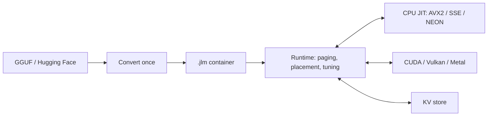

# Runtime and project layout

[Back to the README](../README.md)

**An operating system for LLM inference.**

jitllm scans your hardware, decides where each block of a model runs across
every CPU core and GPU, generates the kernels for that hardware at run time,
and pages weights, experts and KV state through memory as demand changes.

- **Run models larger than memory.** Weights page from disk through RAM and
  VRAM, and a mixture of experts reads only the experts each token routes to.
- **Relocate at run time.** Blocks move between the CPU and GPUs while a model
  serves, and their attention and recurrent state move with them, so a
  conversation survives the move.
- **Long context on a paged KV cache.** The cache grows a page at a time, spills
  to a store and comes back, and reuses prompt prefixes that sessions share.
- **No cgo, no SDK.** One Go executable per platform. It finds the installed
  CUDA, Vulkan or Metal driver at run time and otherwise runs on the CPU.

Serve models through **OpenAI-compatible** chat, completion, model and embedding
endpoints or an **Anthropic-compatible** messages endpoint, with streaming and
tool calling. Models run from the `.jlm` container, which `jitllm convert`
writes once from GGUF or Hugging Face weights.

## The five principles

Every architecture, kernel and path keeps all five; each has a test that
enforces it.

| Principle | Meaning |
|---|---|
| **JIT** | every kernel is emitted at run time for the device in front of it; the only assembly files are the Go-to-generated-code trampolines |
| **No Go compute** | no arithmetic a token runs is a Go loop; a missing optimised kernel is a basic generated kernel, never a fallback |
| **Relocation** | any block, its KV pages and its recurrent state can move host to device and between devices mid-sequence, with the same answer |
| **Paging** | paging is the design, not a mode: a model that does not fit pages, and a budget below the model evicts and re-reads with the same answer |
| **Low to no Go allocation** | a warm decode token makes zero engine heap allocations; weights and page frames live off the Go heap |

## How it works

Kernels are specialised to the model's shapes and weight formats. On a GPU a
whole block (attention, norms, feed-forward, expert routing) runs in one
submission. Tuners measure kernel layouts, worker counts, prompt chunks and
matrix tiles on the machine; applications can override every choice through Go
options.

| Directory | Contents |
|---|---|
| [`jit/cpu`](../jit/cpu/) | the x86-64 and ARM64 code generators |
| [`jit/gpu`](../jit/gpu/) | the kernel IR, its PTX/SPIR-V/MSL lowerings, the backends and the device tier |
| [`engine/model`](../engine/model/) | the graphs, paging, placement and sampling |
| [`format/jlm`](../format/jlm/) | the container and its pager |
| [`convert`](../convert/) | GGUF and safetensors to `.jlm`, the catalog and the Hugging Face client |
| [`tok`](../tok/) | tokenizers, pre-tokenizer pipelines and the chat-template engine |
| [`server`](../server/) | `jitllmd` |
| [`ui`](../ui/) | the desktop app |

## Why Go?

Most inference engines are written in C, C++ or Rust, and some of the best work
is. The choice here is practical:

- **It is the language the author knows best for writing a JIT**: emitting
  machine code, mapping it executable and calling into it.
- **It is portable.** One toolchain cross-compiles every target, and with no cgo
  there is no C toolchain or vendor SDK per target.
- **It compiles fast, so experiments are fast.** Most of this engine was found
  by trying an idea and measuring it.

The hot paths are generated machine code either way; Go carries the parts around
them (paging, placement, scheduling).
